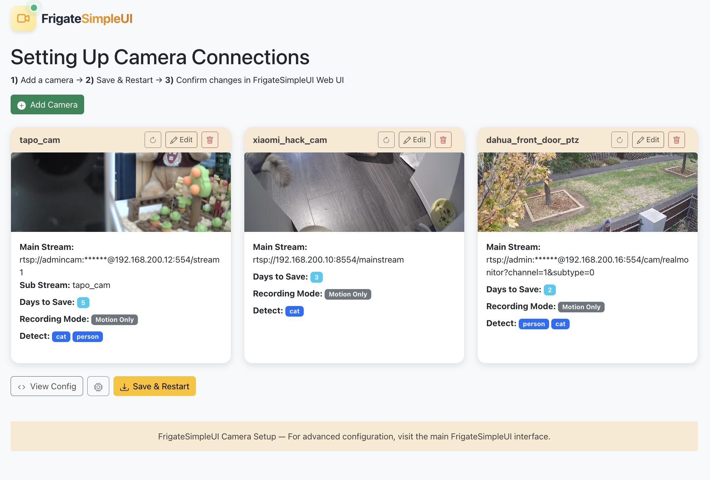

# Frigate-SimpleUI

A simple, user-friendly web interface for setting up and managing IP camera configurations in [Frigate NVR](https://frigate.video/).

Stop hand-editing YAML. Frigate-SimpleUI lets you discover cameras on your network, test streams, configure detection and recording, and push the final config to Frigate -- all from your browser.




---


## Features

- **ONVIF / SADP Camera Discovery** -- Scan your network to automatically find IP cameras (supports multi-NIC setups and Hikvision SADP).
- **Stream Testing & Snapshot Preview** -- Verify RTSP connectivity and see a live snapshot before committing.
- **Camera Management** -- Add, edit, and remove cameras through a clean form-based UI. Changes stay in memory until you explicitly save.
- **Bulk Add** -- Select multiple discovered cameras and add them all at once with shared default credentials.
- **Codec Options** -- Force H.264 re-encoding, enable AAC or Opus audio per camera, or provide a fully custom stream URL.
- **Object Detection Config** -- Choose which objects to track (from Frigate's model labelmap) and set detection resolution per camera.
- **Recording Config** -- Set retention days and mode (motion / active_objects / all) per camera.
- **Coral Detector Settings** -- Enable/disable the Coral Edge TPU and switch between PCI and USB.
- **Raw YAML Editor** -- View and edit the full Frigate config YAML directly from the UI.
- **Save & Restart** -- One-click save to Frigate + go2rtc restart so your changes take effect immediately.


<!-- Add screenshots here once available -->


## Architecture

```
┌──────────────────────────┐
│   React SPA (client)     │
│   Bootstrap UI           │
└───────────┬──────────────┘
            │  REST API
            ▼
┌──────────────────────────────────────┐
│   Node.js / Express Server           │
│   - In-memory config cache           │
│   - ONVIF & SADP scanner            │
│   - Stream tester (ffmpeg)           │
│   - Config builder (YAML)            │
└───────┬──────────────┬───────────────┘
        │              │
   Network scan    Frigate API
   (ONVIF/SADP)    + go2rtc API
        │              │
        ▼              ▼
  ┌──────────┐   ┌─────────────────┐
  │ IP Cams  │   │ Frigate + go2rtc│
  └──────────┘   └─────────────────┘
```

**Client** (React) -- Single-page app with three routes: Dashboard, Add Camera, Edit Camera. Talks to the Express server via REST.

**Server** (Express) -- Acts as a middle layer. Loads the current config from Frigate's API, keeps an in-memory copy, provides scanning/testing/snapshot APIs, and pushes the final YAML back to Frigate when you save.

**Frigate + go2rtc** -- The actual NVR. Frigate-SimpleUI reads and writes its config through Frigate's built-in API (`/api/config/raw`, `/api/config/save`).

---

## Prerequisites

- **Node.js** >= 14.x and **npm** >= 6.x
- A running **Frigate** instance (tested with Frigate <= 0.15) with its API accessible
- **go2rtc** running alongside Frigate (usually bundled)
- **ffmpeg** installed on the machine running Frigate-SimpleUI (used for stream testing and snapshot capture)

---

## Quick Start

### 1. Clone the repository

```bash
git clone https://github.com/lich2000117/Frigate-SimpleUI.git
cd Frigate-SimpleUI
```

### 2. Configure environment

Copy the example env file and edit it to match your setup:

```bash
cp .env.example .env
```

At minimum, set these two values to point at your Frigate instance:

```env
FRIGATESIMPLEUI_URL=http://<your-frigate-ip>:5000
GO2RTC_URL=http://<your-frigate-ip>:1984
```

See [Environment Variables](#environment-variables) below for the full list.

### 3. Install & run (development)

```bash
# Install all dependencies (server + client)
npm run install:all

# Start both server and client in dev mode
npm run dev
```

The React dev server starts on **port 3000** and proxies API requests to the Express server on **port 3001**.

### 4. Or use the convenience script

```bash
# Linux / macOS
chmod +x setup.sh
./setup.sh
```

```bash
# Linux / macOS
chmod +x start-dev.sh
./start-dev.sh
```

---

## Production Deployment

### Build and start

```bash
# Install dependencies
npm run install:all

# Build the React client
npm run build

# Start the production server (serves the built client + API)
npm start
```

The app will be available at `http://localhost:3001` (or whatever `PORT` you set).

### Using PM2 (recommended for long-running deployments)

```bash
# Use the production startup script
chmod +x start-prod.sh
./start-prod.sh
```

This will:
1. Run `setup.sh` (install deps + build client)
2. Copy `.env.production` to `.env`
3. Start the server under PM2 for automatic restarts

---

## Environment Variables

| Variable | Default | Description |
|---|---|---|
| `PORT` | `3001` | Port the Express server listens on |
| `NODE_ENV` | `development` | `development` or `production` |
| `FRIGATESIMPLEUI_URL` | `http://192.168.199.3:5000` | Frigate API base URL |
| `GO2RTC_URL` | `http://192.168.199.3:1984` | go2rtc API base URL |
| `CORS_ORIGINS` | `*` | Allowed CORS origins (comma-separated) |
| `LOG_LEVEL` | `info` | Logging level (`debug`, `info`, `warn`, `error`) |
| `LOG_FILE` | `server.log` | Log file path |
| `MQTT_HOST` | `192.168.199.2` | MQTT broker host (used in generated config) |
| `MQTT_PORT` | `1883` | MQTT broker port |
| `MQTT_USER` | `mqtt-user` | MQTT username |
| `MQTT_PASSWORD` | `mqttpassword` | MQTT password |
| `WEBRTC_CANDIDATES` | `localhost:8555,...` | WebRTC ICE candidates (comma-separated) |
| `WEBRTC_LISTEN` | `:8555/tcp` | WebRTC listen address |
| `DETECTOR_TYPE` | `edgetpu` | Detector type for config generation |
| `DETECTOR_DEVICE` | `pci` | Detector device (`pci` or `usb`) |

---

## Project Structure

```
Frigate-SimpleUI/
├── client/                     # React frontend (CRA)
│   ├── public/                 # Static assets
│   └── src/
│       ├── components/         # Reusable components (Header, Logo)
│       ├── pages/              # Page components
│       │   ├── Dashboard.js    #   Camera list, save/restart, YAML viewer, detector config
│       │   ├── AddCamera.js    #   Network scan, stream test, add camera form
│       │   └── EditCamera.js   #   Edit existing camera settings
│       ├── services/
│       │   └── api.js          # Axios API client (all server calls)
│       ├── styles/             # CSS
│       └── App.js              # React Router setup
├── server/                     # Express backend
│   ├── routes/
│   │   ├── cameras.js          #   GET/POST/DELETE /api/cameras
│   │   ├── scan.js             #   /api/scan (ONVIF + SADP discovery)
│   │   ├── stream.js           #   /api/stream (test, snapshot, status)
│   │   └── detector.js         #   /api/detector (Coral config)
│   ├── utils/
│   │   ├── configManager.js    #   In-memory config, YAML build, Frigate API calls
│   │   ├── networkScanner.js   #   ONVIF + SADP scanning
│   │   ├── streamManager.js    #   RTSP stream testing
│   │   ├── sadp.js             #   Hikvision SADP protocol
│   │   ├── hikvision.js        #   Hikvision device activation
│   │   └── logger.js           #   Winston logger
│   ├── config.js               #   Centralized server config (reads .env)
│   └── index.js                #   Express app entry point
├── .env.example                # Example environment variables
├── package.json                # Root package.json (server deps + scripts)
├── setup.sh                    # Full setup script (install + build)
├── start-dev.sh                # Dev startup convenience script
├── start-prod.sh               # Production startup with PM2
└── README.md
```

---

## API Reference

### Cameras

| Method | Endpoint | Description |
|---|---|---|
| `GET` | `/api/cameras` | List all cameras (from in-memory config) |
| `POST` | `/api/cameras` | Add or update a camera |
| `DELETE` | `/api/cameras/:name` | Remove a camera by name |
| `POST` | `/api/cameras/reload` | Reload cameras from Frigate |

### Network Scanning

| Method | Endpoint | Description |
|---|---|---|
| `GET` | `/api/scan/interfaces` | List available network interfaces |
| `POST` | `/api/scan/all` | Scan for ONVIF/SADP devices on the network |
| `GET` | `/api/scan/streams` | Get stream URLs from an ONVIF device |

### Stream & Snapshots

| Method | Endpoint | Description |
|---|---|---|
| `GET` | `/api/stream/test` | Test if a stream URL is reachable |
| `GET` | `/api/stream/snapshot/:name` | Get a snapshot image from a camera |
| `GET` | `/api/stream/snapshot` | Get a snapshot from a raw RTSP URL |
| `GET` | `/api/stream/frigatesimpleui-status` | Check if Frigate is running |

### Configuration

| Method | Endpoint | Description |
|---|---|---|
| `GET` | `/api/config/raw` | Get current config (JSON) |
| `POST` | `/api/config/raw` | Save raw YAML config to Frigate |
| `GET` | `/api/config/yaml` | Get current config as YAML text |
| `POST` | `/api/config/save` | Save config to Frigate (with optional `?save_option=restart`) |
| `POST` | `/api/config/restart` | Trigger Frigate service restart |
| `POST` | `/api/config/reload` | Reload config from Frigate into memory |
| `GET` | `/api/config/objects` | List available detection objects |

### Detector

| Method | Endpoint | Description |
|---|---|---|
| `GET` | `/api/detector` | Get Coral detector config |
| `POST` | `/api/detector` | Update Coral detector config (`enabled`, `type`) |

### Health

| Method | Endpoint | Description |
|---|---|---|
| `GET` | `/api/ping` | Server health check |

---

## How It Works

1. **On startup**, the server fetches the current config from Frigate's raw config API and loads it into memory.
2. **Dashboard** shows all configured cameras with snapshot thumbnails and Frigate's health status.
3. **Add Camera** lets you scan the network (ONVIF + Hikvision SADP), select a discovered camera (or enter an RTSP URL manually), test the stream, and configure detection/recording options.
4. **Edit Camera** lets you modify any existing camera's settings.
5. All changes are **held in memory** on the server -- Frigate's config is not touched until you click **Save** (or **Save & Restart**).
6. On save, the server builds a complete Frigate YAML config and POSTs it to Frigate's `/api/config/save` endpoint. If you chose restart, go2rtc is also restarted.

---

## Contributing

Contributions are welcome! Here's how you can help:

1. **Fork** the repository
2. **Create a branch** for your feature or bugfix (`git checkout -b feature/my-feature`)
3. **Make your changes** and test locally
4. **Commit** with a clear message
5. **Open a Pull Request** describing what you changed and why

### Development tips

- The React client runs on port 3000 in development and proxies API requests to port 3001 (configured in `client/package.json`).
- The server uses `nodemon` in dev mode for auto-reload.
- Camera configs are kept in memory -- restart the server to reload from Frigate.
- Camera names must be alphanumeric + underscores only, max 32 characters.

### Ideas for contributions

- Docker / Docker Compose setup
- Home Assistant add-on packaging
- Improved camera brand-specific ONVIF handling
- Unit and integration tests
- Dark mode UI
- i18n / localization
- Better mobile responsiveness

---

## License

This project is licensed under the [ISC License](https://opensource.org/licenses/ISC).

---

## Acknowledgments

- [Frigate NVR](https://frigate.video/) -- The excellent open-source NVR this tool is built for.
- [go2rtc](https://github.com/AlexxIT/go2rtc) -- The streaming engine used by Frigate.
- [node-onvif](https://github.com/nickersk/node-onvif) -- ONVIF device discovery for Node.js.
